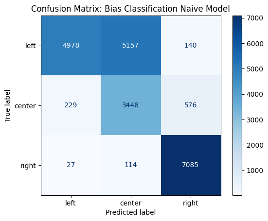
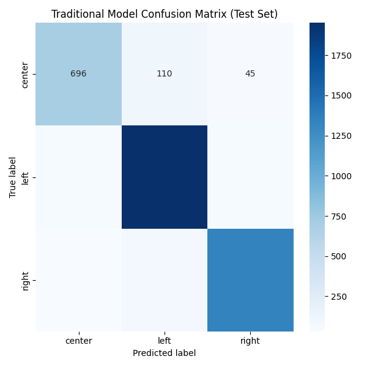
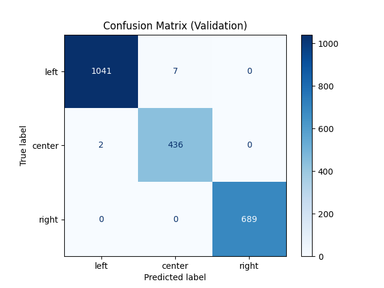
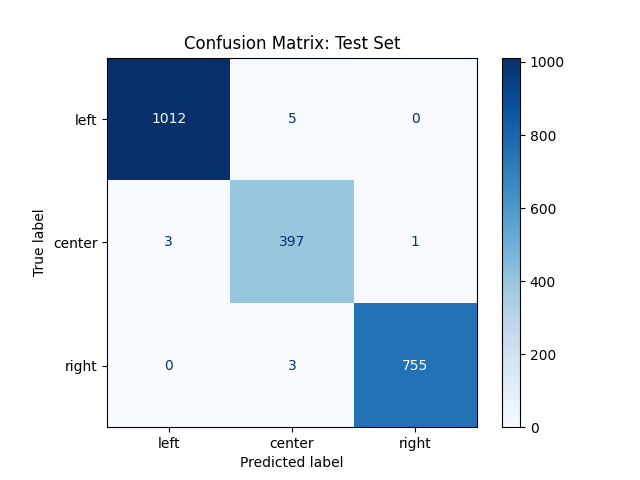

# Bias_Inspector
[dataset_reference] (https://github.com/Swati17293/LLNewsBias)
[streamlit] (https://appfrontendpy-7ymgzxz6suz2dghrxxtbzh.streamlit.app/)

The streamlit application trained from this model is deployed on the streamlit cloud utlizing my personal API key.  

## Problem Statement: 
The world's population is currently living in a paradox. The internet has made the world smaller, yet more isolated from each other. Technology allows each one of us to consume information in our own biased echo chamber unencumbered by rationale or different perspectives. This project aims to address this issue by analyzing bias in our daily information and presenting that bias in a clear, concise, and simple way.

## Description of Dataset
This large dataset was designed by researchers to detect and analyze political bias in news headlines. Covering four major global events — Brexit, COVID-19, the 2020 U.S. election, and the Ukraine-Russia war — from 2019 to 2022, the dataset features over 300,000 headlines, each annotated with bias labels[Center, left, right]. The headlines span from all over the world. Due to incomplete entries and malformed data outputs, the english subset of this dataset, comprising of over 23000 entries was used to train and test the models described below. 

This dataset is licensed under the MIT License. For more information governing the use and distribution of this dataset, please see the accompanying LICENSE file included in this repo.

## Instructions to Run Script

To set up the development environment: 

For Windows:

1) Activate Virtual Environment
   ```
   python  -m venv venv
   .venv .venv/Scripts/activate 
   ```
    
2) Install the requirements.txt file
    ``` 
    python -m pip install -r requirements.txt 
    ```

3) Execute Model Pipeline
    ``` 
    data_loader.py 

## Description of Scripts:
The main script data_loader.py will sequentially execute the naive, traditional, and deep learning models described below. It will look for the dataset under Data/Raw sub-directory.

### Naive Model 
The associated script is naive_model.py 

#### Modelling Approach
The naive modeling pipeline utilizes the "gpt-4.1-mini"  OpenAI language model to classify articles according to the labelled bias: "left", "right", and "center". The pipeline has a pre-defined prompt based on datatypes within the dataset such as title, tags, heading, source, and text content from a labeled DataFrame. Each prompt instructs the model explicitly to respond only with a bias label. 

Gpt-4.1-mini was chosen due to cost considerations. No training was conducted, hence the "naive" description of the model. The max_tokens was set at 32000 (the limit of the model).  

After prompt preparation, the pipeline sends these to the OpenAI API for prediction, and attempts to parse the resulting output as a json file to extract the predicted label. If the ouput is invalid, the raw string is captured as the label. The responses are aggregated and assigned back to the DataFrame as predicted labels and saved under Analysis sub-directory.

Finally, the pipeline calculates a classification report (including metrics like precision, recall, and F1-score) and plots a confusion matrix to visualize model performance across the three bias categories. Both the textual report and confusion matrix plot are saved in a specified analysis directory to support further inspection. 

### Traditional ML Pipeline (support vector machine)
The associated script is svm.py

#### Modelling Approach
The traditional pipeline utilizes a support vector machine for classifying political bias in news articles with a bag-of-words text representation enhanced by TF-IDF weighting.

Attributes such as title, text, tags, heading, and source, alongside a bias_rating label are extracted from the dataset. Each text field undergoes a processing step, where uppercase text and puntuation is removed to normalize the input data and reduce noise. THe processed text outputs are concatenated into a single input text feature for modeling.

The dataset is then split into training, validation, and test sets, stratified on the label, to guard against class imbalancing. Text data in these splits is vectorized to capture unigrams and bigrams, which balances term frequency against document frequency to emphasize informative words during feature extraction.

Hyperparameter tuning is employed to select the best model, which is saved in "Models" sub-directory. Finally, the model is evaluated on the test set with metrics such as accuracy, precision, recall, and F1-score, alongside a confusion matrix visualization that are saved in the Analysis sub-directory.

### Deep Learning Model 
The associated scripts are deep_learning.py, validation_deep_learning.py, & deep_learning_test_model.py. 

#### Modelling Approach
A deep learning model utilizing OpenAI framework is utilized for the task of news article political bias classification. 
Unlike the naive model, the dataset is loaded and trained using a fine-tuning approach. The dataset is converted into a representative .json format that the model can consume, using scripts located in the "Scripts" sub directory. The pipeline shuffles it to keep training robust, and divides it into training, validation, and test sets with a 80/20/10 split. These splits are saved as separate json files into the Data/Processed sub-directory. The pipeline then uploads the training and validation files using the OpenAI API and initiates a fine-tuning job with Gpt-4.1-mini. Hyperparameters like the number of epochs was chosen at 4, and learning rate is set to 0.1 through trial and error. 


Once fine-tuning is completed, predictions are generated on test articles without labels. The test inputs as user prompts are sent to the deployed fine-tuned model via the OpenAI API for bias classification predictions: “left”, “center”, or “right”. Ground truth labels are separately loaded from a labeled test json file for evaluation. The script aggregates predicted versus true labels and outputs a detailed classification report, overall accuracy, and plots a confusion matrix and stored in the "Analysis" sub-directory.

Separately, the deep learning model is validated. Json data from the validation set, containing article texts and true labels, performs prediction on these samples, and saves comprehensive evaluation outputs including classification reports and confusion matrix plots.

## Model Evaluation & Metric Selection
In analyzing the classification report, F1 score is preferred in this case due to class imbalances amongst the data, as well as the need to consider both precision (evaluating false positives) and recall  (evaluating false negatives) in the analysis. In our use case, predicting bias when it is not present, as well as not predicting bias in the case where does indeed exist, would appear to be equally costly. 

    # Figure 1 Confusion Matrix - Naive Model


    # Figure 2 Classification Report - Naive Model


    # Figure 3 Confusion Matrix - Traditional Model


    # Figure 4 Classification Report - Traditional Model


    # Figure 5 Confusion Matrix - Validation Set - Deep Learning Model


    # Figure 6 Classification Report - Validation Set - Deep Learning Model


    # Figure 7 Confusion Matrix - Test Set - Deep Learning Model


    # Figure 8 Classification Report - Test Set - Deep Learning Model


## Results and Conclusions

The Naive model shows a large variation in performance between the classes. While it is strong for “right” classes (F1 = 0.94), it performs much worse for “left” (F1 = 0.53) and “center” (F1 = 0.64). This indicates that class imbalance affects the model. For the traditional model, each class has a high score where the F1 score is greater than 80 percent. Incorporating class balancing and cleaning the data appears to have helped performance. The deep learning model is fairly perfect across both the validation and test sets, which indicates the model has been trained well but has not overfir to the data, which is as expected. The fine tuned deep learning model was chosen to power the resultant streamlit application.   

## Ethics Statement
This project is committed to upholding high ethical standards, with correct attribution. I would like to acknowledge [LLNewsBias](https://github.com/Swati17293/LLNewsBias?tab=MIT-1-ov-file) for utilizing their public dataset for re-use. All personal information has been de-identified. The pipelines described above have been created for this project using publicly available python libraries. AI tools were used to help generate doc strings for resultant functions.  
